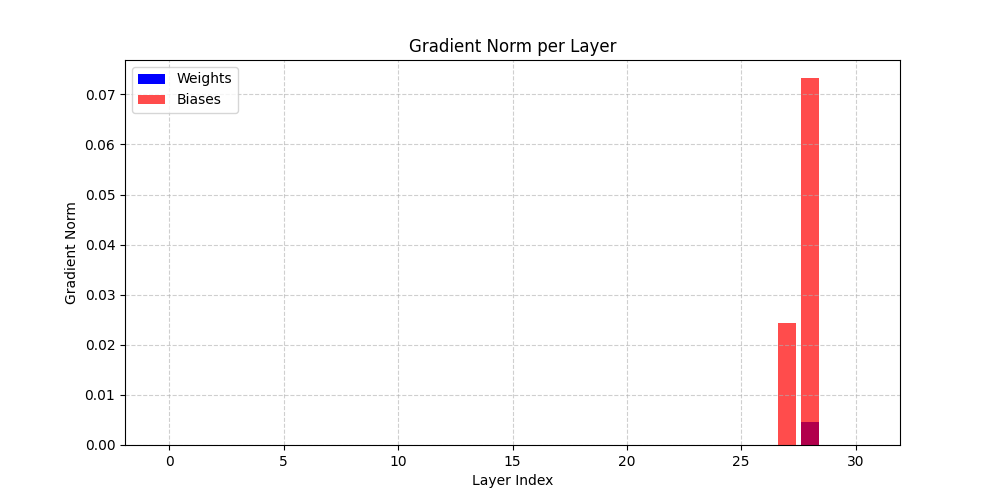
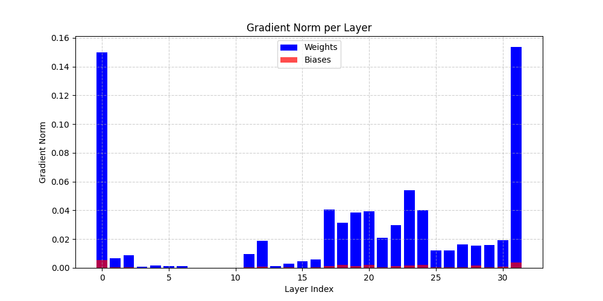
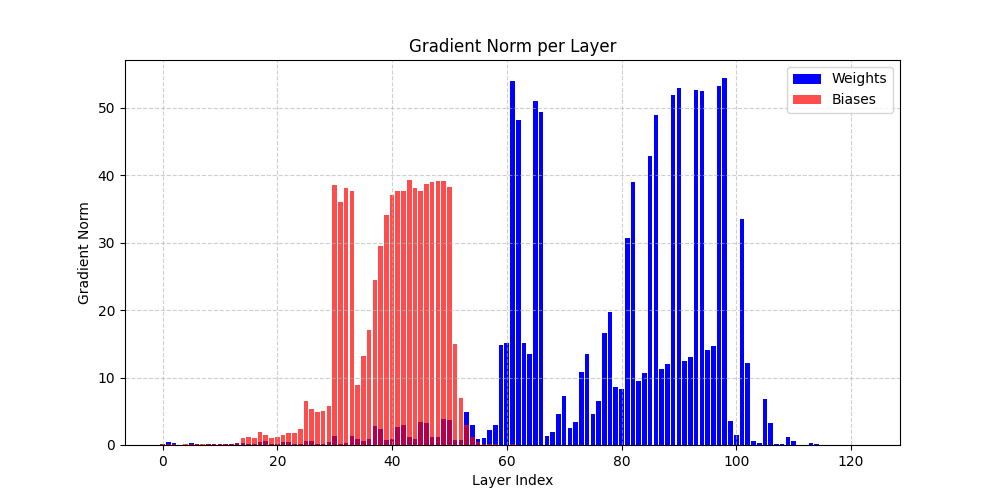
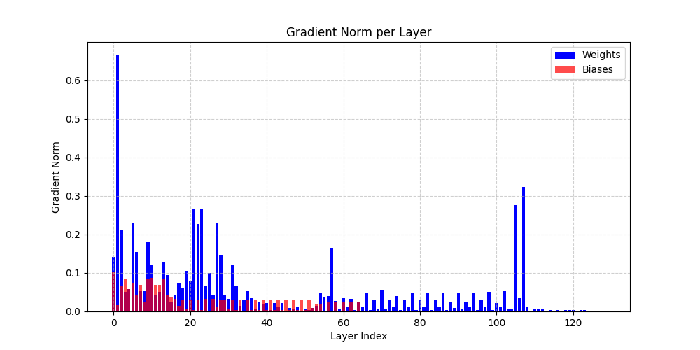
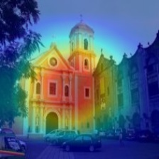
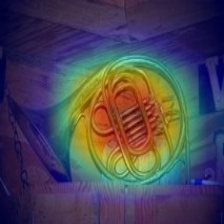
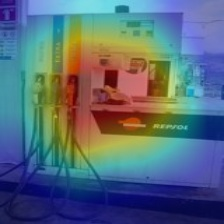
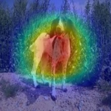

# 🧪 Lab 1 – Deep Neural Networks: MLPs, ResMLPs, and CNNs

This lab focuses on training deep models—**MLPs**, **Residual MLPs**, and **CNNs**—on standard image classification datasets (MNIST, CIFAR10, CIFAR100). The key objectives are:

- Reproducing results from:
  - 📄 [*Deep Residual Learning for Image Recognition*](https://arxiv.org/abs/1512.03385) (He et al., CVPR 2016)
  - 📄 [*Learning Deep Features for Discriminative Localization*](http://cnnlocalization.csail.mit.edu/) (Zhou et al., CVPR 2016)
- Understanding the effect of residual connections on model performance
- Visualizing class activation maps (CAMs)
- Investigating training dynamics and gradient flow

---

## 📂 Folder Structure

```bash
lab1/
│
├── data/                   # Cached datasets
├── models/                 # MLP, ResMLP, and CNN model implementations
├── dataloaders.py          # Utility functions for dataloading.
├── main.py                 # Main training entry point
├── main_cam.py             # Main CAM entry point
└── README.md               # This file
```

---

## ⚙️ How to Run

You can run training from the command line using `main.py`. The script is fully configurable via command-line arguments.

### 🔧 Example: Train a ResMLP on MNIST

```bash
python main.py --model resmlp --dataset mnist --depth 4 --width 64 --bn --use-wandb
```

### 🔧 Example: Train a CNN with skip connections on CIFAR10

```bash
python main.py --model cnn --dataset cifar10 --skip --layers 2 2 2 2 --use-wandb
```

---

## 🧠 Supported Arguments

| Argument         | Description |
|------------------|-------------|
| `--model`        | Model type to use: `mlp`, `resmlp`, `cnn` |
| `--dataset`      | Dataset to use: `mnist`, `cifar10`, `cifar100` |
| `--lr`           | Learning rate (default: 0.001) |
| `--epochs`       | Number of training epochs (default: 50) |
| `--batch-size`   | Batch size (default: 256) |
| `--depth`        | Number of hidden layers (MLP/ResMLP only) |
| `--width`        | Width of hidden layers (MLP/ResMLP only) |
| `--bn`           | Use BatchNorm (only MLP/ResMLP) |
| `--skip`         | Enable skip connections in CNN |
| `--layers`       | CNN block configuration (default: `[2 2 2 2]`) |
| `--schedule`     | LR drop milestones (e.g., `--schedule 35`) |
| `--cos`          | Use cosine LR scheduling |
| `--val-split`    | Fraction of training data used for validation (default: 0.1) |
| `--seed`         | Set random seed for reproducibility |
| `--device`       | Device to use: `cpu` or `cuda` |
| `--use-wandb`    | Enable Weights & Biases logging |

---

## 📊 Visualizations & Logging

If `--use-wandb` is enabled, training metrics and model summaries are logged to:

🔗 [W&B Project – Lab 1](https://wandb.ai/jaysenoner/lab_1_DLA?nw=nwuserjaysenoner1999)

You can view:

- Learning curves
- Validation accuracy
- Test Top-1 and Top-5 accuracy
- Parameter counts
- Model summaries

---

## 🧪 Results Summary

Key findings include:

- Residual connections significantly improve training stability and final accuracy, especially for deeper networks.
- Residual connections allow the gradients to backpropagate to earlier layers of the network with a stronger signal
- CNNs with skip connections demonstrate higher accuracy on CIFAR datasets. Moreover, CNNs with skip connections are less prone to overfitting.
- This trend is exxagerated when the depth of the convolutional network is increased.
- Class Activation Maps allow localization of discriminative image regions without additional supervision.

More material that supports those findings can be found inside the `wandb` project. 

### 📈 Gradient Flow on Network Layers

#### MLP vs ResMLP on MNIST

<p align="center">
  
  
</p>

#### CNN vs ResNet on CIFAR10

<p align="center">
  
  
</p>


### 🔍 Class Activation Maps (CAMs on Imagenette)

<p align="center">
  
  
</p>

<p align="center">
  
  
</p>
---

## 📎 References

- [Deep Residual Learning for Image Recognition](https://arxiv.org/abs/1512.03385) — He et al., 2016
- [Learning Deep Features for Discriminative Localization](http://cnnlocalization.csail.mit.edu/) — Zhou et al., 2016

---

## 📬 Contact

For questions or feedback, feel free to reach out via GitHub Issues or contact the author of this lab at:

👤 [Jaysenoner on GitHub](https://github.com/jaysenoner99)

---

```bash
💡 Tip: Run `python main.py --help` to view all available arguments.
```
