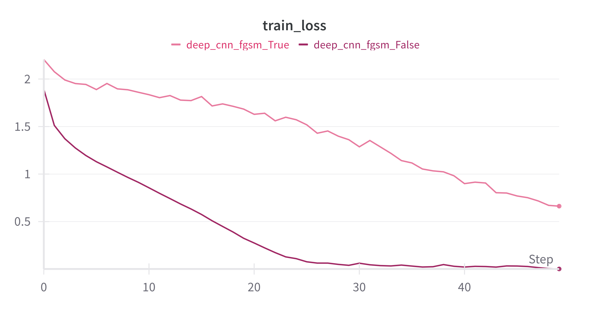
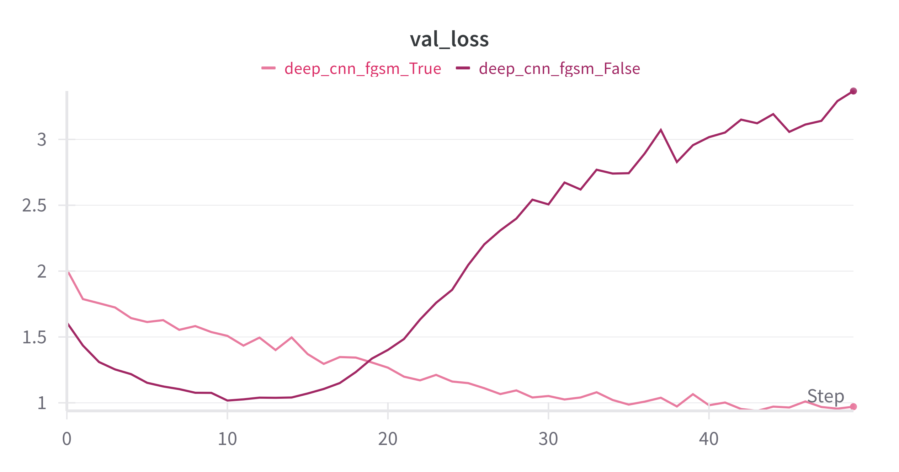
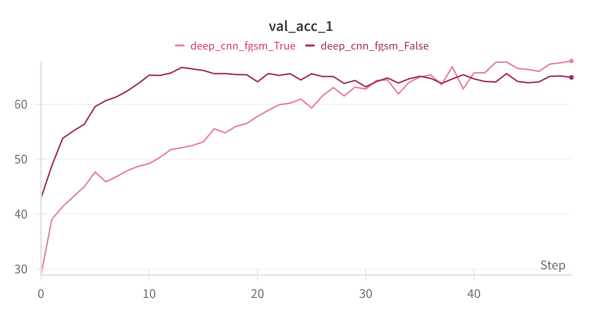

# Lab 2: Adversarial Machine Learning, OOD Detection, and Adversarial Robustness

This folder contains the implementation of the second laboratory assignment for the **Deep Learning Applications** course (University of Florence, MSc in Artificial Intelligence). The focus of this lab is on understanding the vulnerabilities of deep learning models to out-of-distribution (OOD) inputs and adversarial attacks, as well as exploring methods to enhance model robustness.

---

## 📦 Contents

- **Model Training**:
  - Train either a Convolutional Neural Network (CNN) or an Autoencoder (AE) on MNIST, CIFAR10, or CIFAR100.
  - Optional adversarial training using Fast Gradient Sign Method (FGSM).
- **Adversarial Attacks**:
  - Targeted and untargeted attacks with different epsilon values.
- **OOD Detection**:
  - Max logit and max softmax scoring to distinguish in-distribution vs OOD samples.
- **Evaluation**:
  - Evaluate the performance of models on adversarial and OOD samples.

---

## 📂 Folder Structure

```bash
lab2/
│
├── dataloaders.py          # Utilities to load datasets
├── model.py                # CNN and Autoencoder implementations
├── fgsm.py                 # Perform targeted/untargeted attacks on pretrained classification networks
├── main.py                 # Main training entry point
├── train_and_test.py       # Training and testing routines
└── README.md               # This file
```
---

## 🚀 Usage

### 🔧 Example: Train a CNN with FGSM augmented samples

```bash
python main.py --model cnn --fgsm --epsilon 0.05 --use-wandb
```

### 🧪 Example: Perform a targeted attack on a pretrained CNN

```bash
python fgsm.py --model cnn --step 0.01 --max 0.2 --target-class 3 --use-wandb
```

### 📊 Example: Evaluate OOD detection with max-softmax scoring 

```bash
python eval.py --model cnn --score softmax --path path_to_weights.pth
```

---

## 📥 Supported Arguments

### `main.py`

This script trains either a CNN classifier or an Autoencoder on CIFAR-10 with options for:

- Customizable learning rate, epochs, batch size, and learning rate schedules (step or cosine).
- Using FGSM adversarial samples during training (`--fgsm` flag).
- Device selection (CPU/GPU auto-detection).
- Reproducibility through random seed setting.
- Optional integration with Weights & Biases (`wandb`) for experiment tracking.
- Saving trained model weights automatically.
- Reporting test accuracy (top-1 and top-5 for CNN) or reconstruction metrics (for AE).

| Argument       | Description                                                                 |
|----------------|-----------------------------------------------------------------------------|
| `--lr`         | Initial learning rate (default: `0.0001`)                                  |
| `--epochs`     | Total number of training epochs (default: `50`)                            |
| `--schedule`   | Epochs to reduce learning rate by 10x (default: `[125, 175]`)              |
| `--batch-size` | Batch size for training (default: `256`)                                   |
| `--cos`        | Use cosine annealing learning rate schedule                                |
| `--device`     | Device to use (`cpu` or `cuda`, auto-selected)                             |
| `--val-split`  | Proportion of training data for validation (default: `0.1`)                |
| `--seed`       | Random seed for reproducibility (default: `69`)                            |
| `--use-wandb`  | Enable Weights & Biases logging                                            |
| `--model`      | Choose `cnn` or `ae`                                                       |
| `--fgsm`       | Enable adversarial training using FGSM                                     |
| `--epsilon`    | Epsilon for FGSM perturbation (default: `0.07`)                            |
| `--path`       | Path to model weights to load                                              |

---

### `fgsm.py`

This script performs and evaluates Fast Gradient Sign Method (FGSM) adversarial attacks on pretrained CNN or Autoencoder models trained on CIFAR-10.

- Supports **targeted** and **untargeted** FGSM attacks.
- Generates adversarial examples by perturbing inputs in the direction of the gradient.
- Evaluates model accuracy under different perturbation strengths (`epsilon` values).
- For CNNs:
  - Measures classification accuracy and targeted attack success rate.
- For Autoencoders:
  - Measures reconstruction error (MSE) on perturbed inputs.
- Visualizes results:
  - Accuracy or loss vs epsilon plots.
  - Sample adversarial examples.
  - Targeted attack success rate
- Integrates with Weights & Biases (`wandb`) for logging.

Use this script to assess model robustness to adversarial perturbations and analyze the effect of varying attack strengths.

| Argument         | Description                                                                 |
|------------------|-----------------------------------------------------------------------------|
| `--device`       | Device to use (`cpu` or `cuda`, auto-selected)                             |
| `--batch-size`   | Batch size (default: `1`)                                                   |
| `--val-split`    | Proportion of training data for validation (default: `0.1`)                |
| `--seed`         | Random seed (default: `69`)                                                 |
| `--use-wandb`    | Enable Weights & Biases logging                                            |
| `--model`        | Choose `cnn` or `ae`                                                       |
| `--step`         | Step increment for epsilon values (default: `0.025`)                       |
| `--max`          | Maximum epsilon value for perturbation (default: `0.2`)                    |
| `--path`         | Path to model weights to load                                              |
| `--target-class` | Class index for targeted FGSM attacks                                      |

---

### `eval.py`

This script evaluates a pretrained model's ability to distinguish in-distribution (ID) from out-of-distribution (OOD) samples using simple scoring functions.

- Loads a CNN or autoencoder trained on CIFAR-10.
- Loads a set of fake (OOD) samples.
- Computes OOD scores using either:
  - **Max logit**
  - **Max softmax** 
- Evaluates the model’s performance in separating ID and OOD data.
- Supports Weights & Biases (`wandb`) for logging metrics and visualizations.

Use this script to test the robustness of your trained model against OOD inputs by analyzing score distributions and computing metrics like AUROC.

| Argument       | Description                                                                 |
|----------------|-----------------------------------------------------------------------------|
| `--device`     | Device to use (`cpu` or `cuda`, auto-selected)                             |
| `--batch-size` | Batch size (default: `256`)                                                 |
| `--seed`       | Random seed (default: `69`)                                                 |
| `--epochs`     | Number of evaluation iterations (default: `200`)                           |
| `--val-split`  | Validation data proportion (default: `0.1`)                                 |
| `--use-wandb`  | Enable Weights & Biases logging                                            |
| `--model`      | Choose `cnn` or `ae`                                                       |
| `--score`      | Scoring function: `logit` or `softmax`                                     |
| `--path`       | Path to model weights to load                                              |

---

## 📊 Results Summary

### 🔒 Training with Adversarial Examples

<p align="center">
  
  
  
</p>


| Model | FGSM Training | Epsilon | Test Accuracy | Adversarial Accuracy |
|-------|---------------|---------|----------------|----------------------|
| CNN   | ❌             | -       | 91.2%          | 12.7%                |
| CNN   | ✅             | 0.07    | 89.5%          | 74.3%                |

### 🚫 OOD Detection

| Model | Scoring Function | OOD Dataset    | AUROC |
|-------|------------------|----------------|--------|
| CNN   | Softmax          | FashionMNIST   | 92.5%  |
| AE    | Logit            | SVHN           | 88.1%  |

---

## 🖼️ Example Results


---

## 📚 References

- [Goodfellow et al. (2015)](https://arxiv.org/abs/1412.6572): Explaining and Harnessing Adversarial Examples  
- [Hendrycks & Gimpel (2017)](https://arxiv.org/abs/1610.02136): A Baseline for Detecting Misclassified and Out-of-Distribution Examples in Neural Networks

---

## 🧑‍💻 Author

Jaysen Oner — [@jaysenoner99](https://github.com/jaysenoner99)
