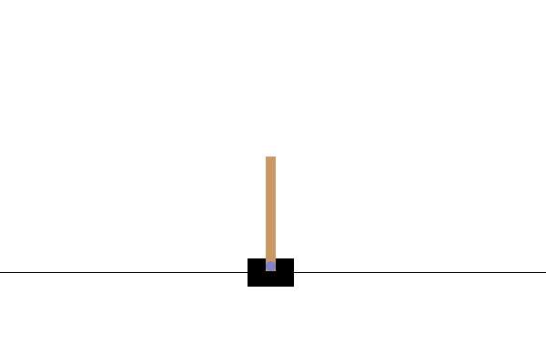
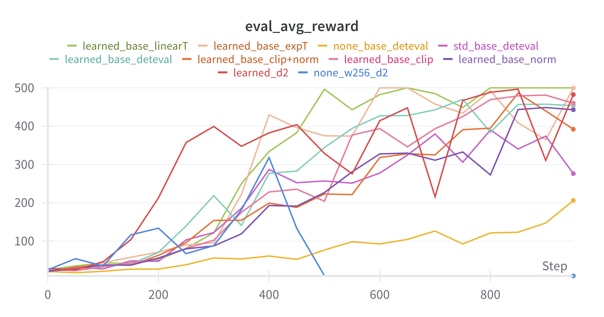
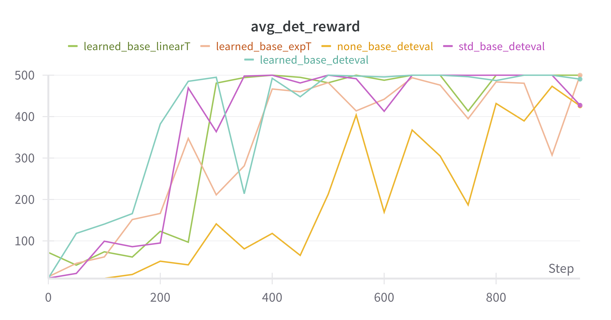
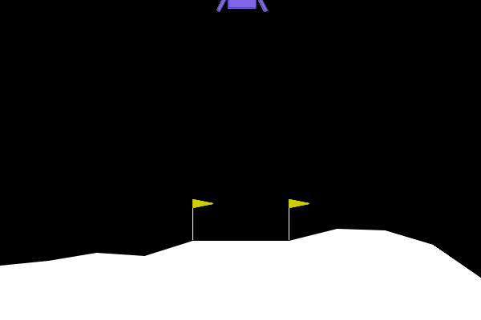
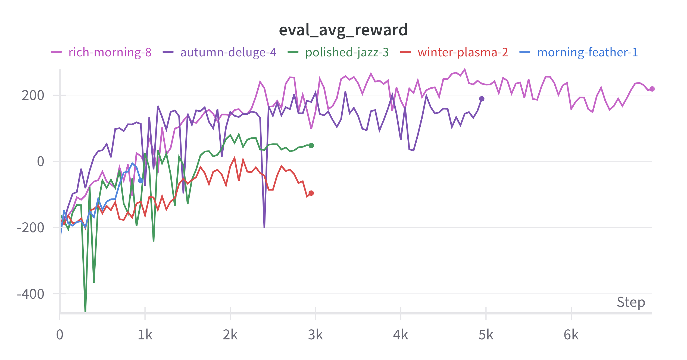
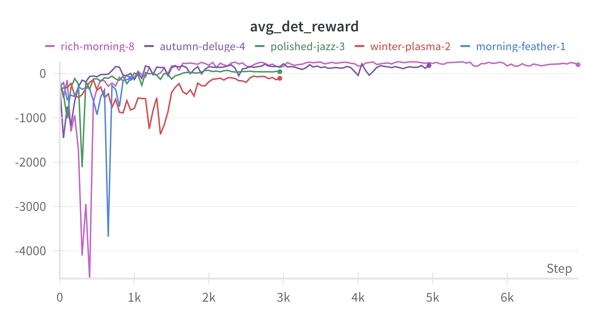

# Lab 3 — Deep Reinforcement Learning

This lab implements the REINFORCE algorithm to train an agent in the **CartPole-v1** and **LunarLander-v3** environments using PyTorch. 
The project supports various enhancements including value baselines, entropy regularization, gradient clipping, and temperature scheduling.

- **Training (main script)**:
  - Trains a policy using the REINFORCE algorithm.
  - Supports optional baselines: none, std or learned (value network).
  - Allows advantage normalization, gradient clipping, and temperature scheduling.
  - Evaluates and logs performance to wandb.

- **Networks**:
  - `PolicyNet`: Feedforward policy network for action selection.
  - `ValueNet`: Optional baseline network for advantage estimation.

- **Evaluation & Visualization**:
  - Stochastic and Deterministic Policy sampling.
  - `visualize.py`: Loads a trained policy checkpoint and runs it in a visual environment for inspection.
  - Register `.gif` of agents in the Cartpole/LunarLander visual environment 

- **Utilities**:
  - Modular structure to allow plug-and-play of environments, policies, and configurations.
  - Command-line arguments for different training and evaluation setups.
  
## 📁 Folder Structure

```
├── main.py           # Entry point for training
├── reinforce.py      # Core REINFORCE training loop
├── visualize.py      # Visualize a trained agent and render a gif 
├── networks.py       # Policy and value network definitions
├── utils.py          # Utility functions for training and evaluation
└── README.md         # This file
```

---

## 🚀  Usage

Use `main.py` to train an agent on a given environment.

### 🔧 Example: Train an agent on LunarLander-v3 

```bash
python main.py --env lunarlander --baseline std --episodes 1000 --depth 2 --width 256 --normalize --clip-grad --det --T 1.0 --t-schedule exp
```

### 🎮 Example: Visualize a pretrained agent trying to do its best

```bash
python visualize.py --checkpoint path/to/policy_weights
```
### 🎮 Example: Save a gif of an agent landing on the moon

```bash
python visualize.py --checkpoint path/to/policy_weights --env lunarlander --gif --deterministic --gif-path landing_loop.gif
```
## 📥 Supported Arguments

###  `main.py`

This script is the main training entry point for running the REINFORCE algorithm using PyTorch on CartPole-v1 or LunarLander-v3 environments. 

- Manages experiment configuration and logging

- Sets up environments and models

- Trains a REINFORCE agent using the specified configuration

- Optionally visualizes the trained agent

| Argument              | Description                                                                 |
|-----------------------|-----------------------------------------------------------------------------|
| `--env`               | Environment to train on: `cartpole` or `lunarlander`                        |
| `--baseline`          | Baseline to use: `none`, `std`, or `learned`                                |
| `--episodes`          | Number of episodes to train for                                             |
| `--depth`             | Number of hidden layers in policy/value networks                            |
| `--width`             | Width of each hidden layer                                                  |
| `--lr`                | Learning rate (default: `1e-3`)                                              |
| `--gamma`             | Discount factor (default: `0.99`)                                           |
| `--normalize`         | Normalize the advantage term                                                |
| `--clip-grad`         | Clip gradients to unit norm                                                 |
| `--det`               | Perform deterministic evaluations                                           |
| `--T`                 | Initial temperature for action sampling                                     |
| `--t-schedule`        | Temperature schedule: `lin`, `exp`, or leave unset for static temperature   |
| `--eval-interval`     | How often to evaluate the policy                                            |
| `--eval-episodes`     | Number of episodes to run during each evaluation                            |
| `--visualize`         | Visualize the final trained policy after training                           |


### `visualize.py`


This script is used to **load and visualize a trained policy network** in either the CartPole or LunarLander environments. 
The policy is loaded from a specified checkpoint and used to run a number of episodes, rendered in a window for visual inspection.
The script allows the user to optionally render a `.gif` of a previously trained agent acting inside the environment.

| Argument         | Type    | Default                                               | Description                                                                 |
|------------------|---------|-------------------------------------------------------|-----------------------------------------------------------------------------|
| `--checkpoint`   | `str`   | `"wandb/latest-run/files/checkpoint-BEST_EVAL_POLICY.pt"` | Path to the policy checkpoint file.                                         |
| `--episodes`     | `int`   | `10`                                                  | Number of episodes to run (used only if not recording a GIF).               |
| `--temperature`  | `float` | `1.0`                                                 | Softmax temperature for the policy sampling.                                |
| `--deterministic`| `flag`  | `False`                                               | If set, uses greedy action selection instead of sampling.                   |
| `--env`          | `str`   | _(required)_                                          | Environment to run: `cartpole` or `lunarlander`.                            |
| `--width`        | `int`   | `256`                                                 | Width of the hidden layers in the policy network.                           |
| `--depth`        | `int`   | `2`                                                   | Number of hidden layers in the policy network.                              |
| `--gif`          | `flag`  | `False`                                               | If set, records a single episode as a GIF instead of running multiple episodes interactively. |
| `--gif-path`     | `str`   | `"lander.gif"`                                        | Output path for the recorded GIF if `--gif` is set.                         |

---

## 📊 Evaluation & Logging

Evaluation is done every `--eval-interval` steps with `--eval-episodes` episodes.

Logged metrics include:
- Episode return and length
- Evaluation reward (stochastic and deterministic)
- Losses: policy and value loss (if using learned baseline)
- Temperature schedule

Model checkpoints are saved to:
```
wandb/latest-run/files/checkpoint-BEST_EVAL_POLICY.pt
```

---

## 📊 Results Summary

#### 🏗️ Cartpole-v1: Qualitative Results



<p align="center">
  
</p>

#### 🏗️ Cartpole-v1: Stochastic and Deterministic Average Evaluation Rewards

<p align="center">
  
  
</p>

#### 🌕 LunarLander-v3: Qualitative Results



#### 🌕 LunarLander-v3: Stochastic and Deterministic Average Evaluation Rewards

<p align="center">
  
  
</p>

